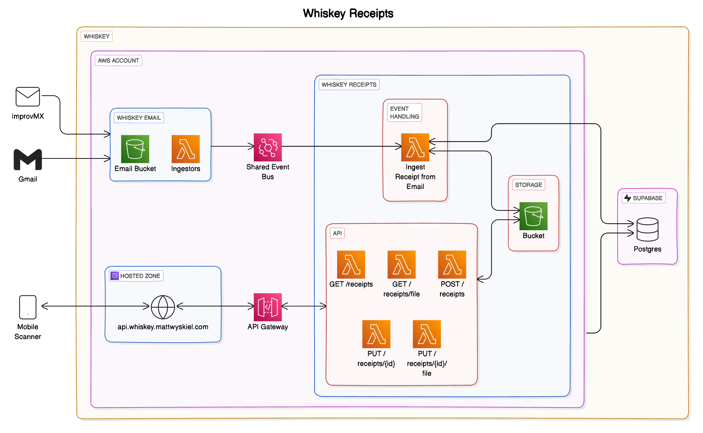

# Whiskey Receipts

[Whiskey](https://github.com/whiskey-platform) is an event-based personal automation system. One of the core use cases that began this project is the automation of saving and cataloging receipts for future reference.

## Architecture

This component in particular has been iterated over many times, as I've refined and redefined my criteria for what I'm looking to get out of this system. Here is the latest diagram, accounting for the new use of both EventBridge and Supabase.

## Roadmap

This is a refactoring and migration of two existing repositories, `whiskey-receipts-service` and `receipt-extractors` to the new EventBridge event schemas. As such, this will take some time. And iteration. So, we prioritize!

- [x] Retrieve receipt information
- [x] Retrieve receipt file from Bucket
- [x] Upload receipt directly via API handshake
- [ ] Update receipt information
- [ ] Delete receipt
